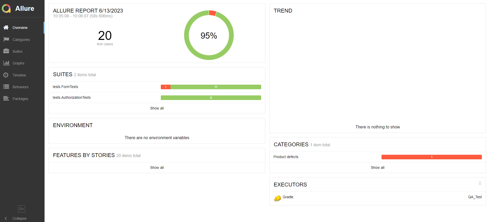
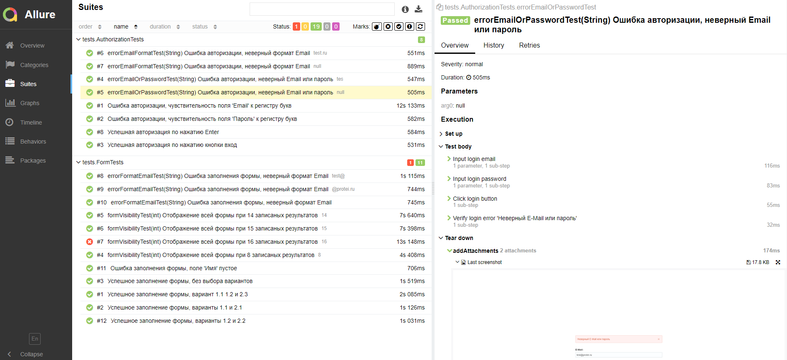
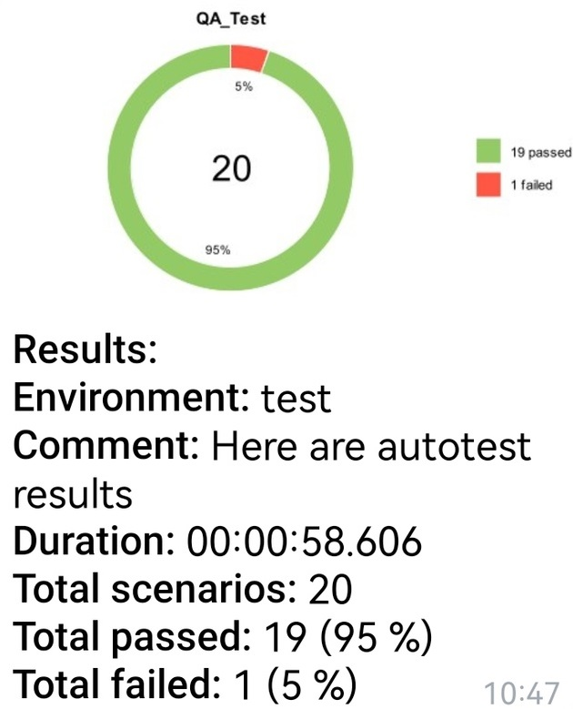
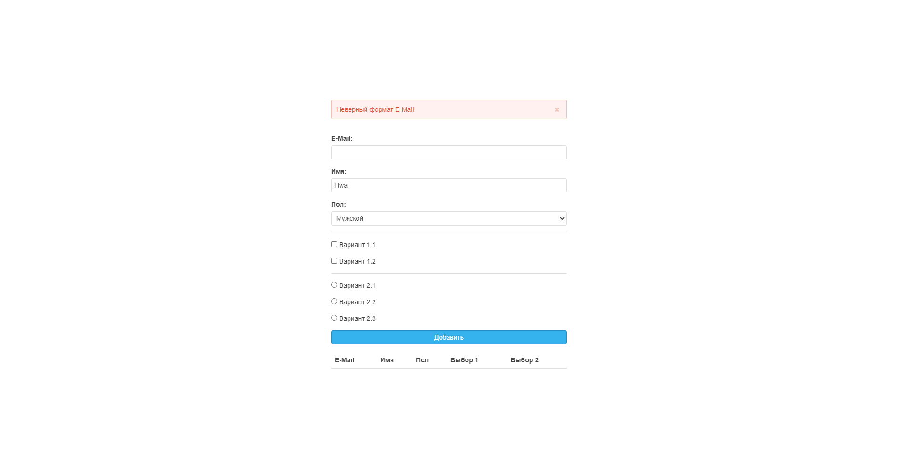

# QA_Test
##  :rocket: Запуск тестов

### Локальный запуск тестов

```bash
gradle clean test
```
## </a> Отчет в <a target="_blank" >Allure report</a>

###  Главное окно

<p align="center">

</p>

###  Тесты

<p align="center">

</p>

## </a> Уведомление в Telegram о результатах прогона тестов

<p align="center">

</p>

###  Скриншот выполненного теста
К каждому тесту в отчете прилагается последний скриншот теста.
<p align="center">
  
</p>
